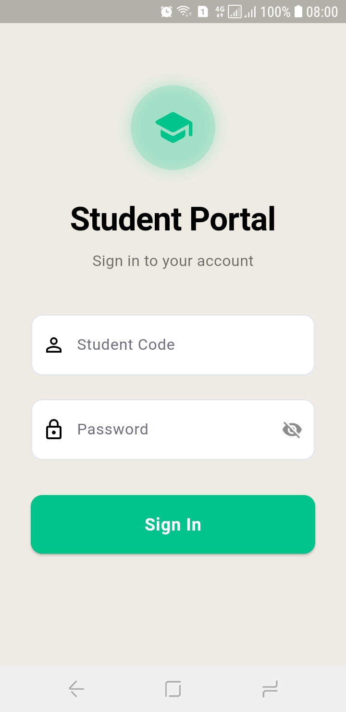
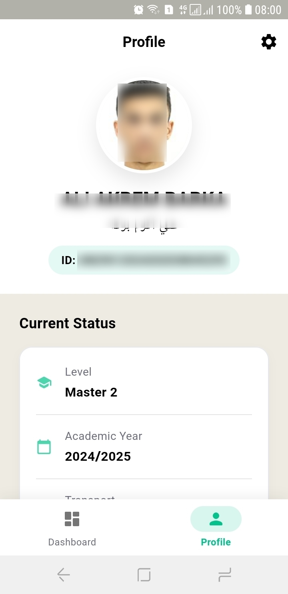
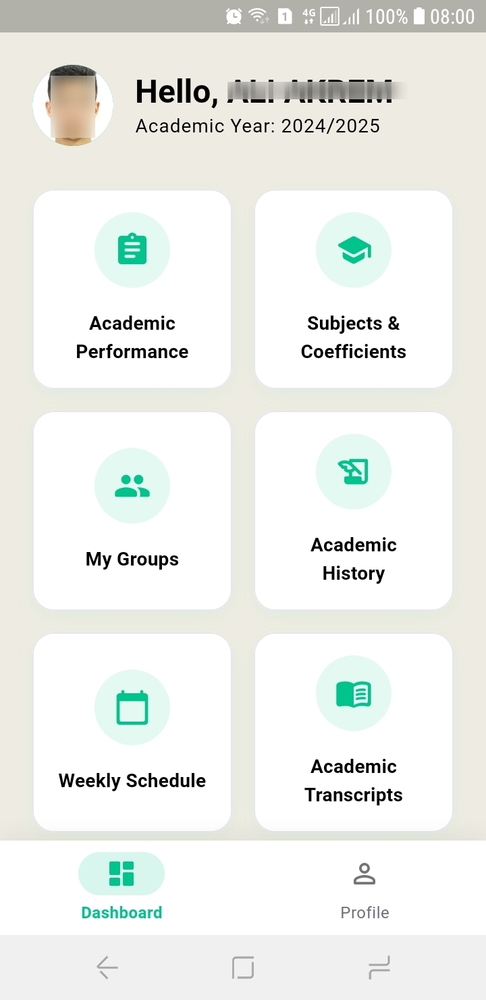
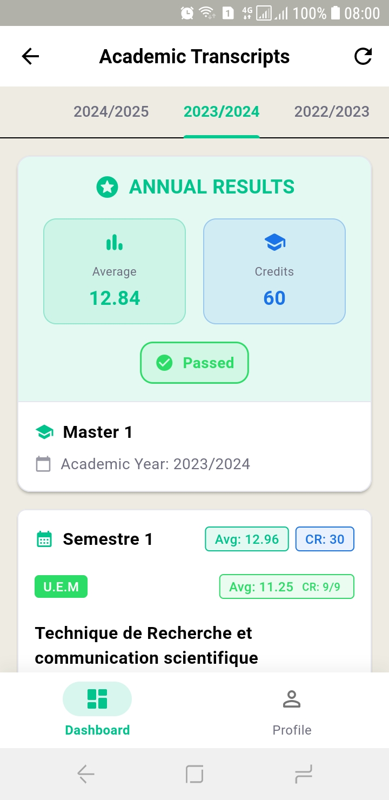
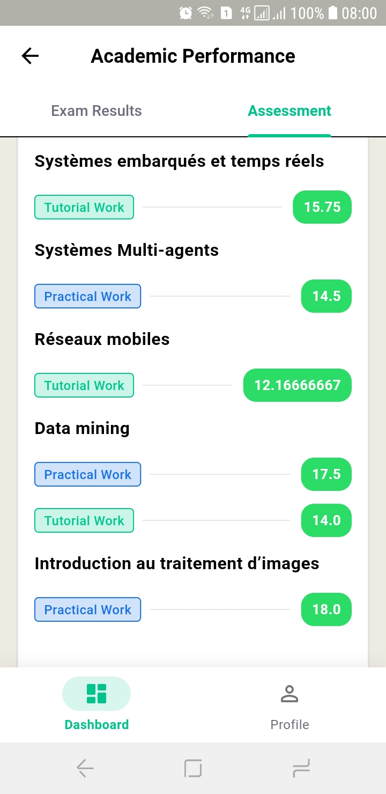
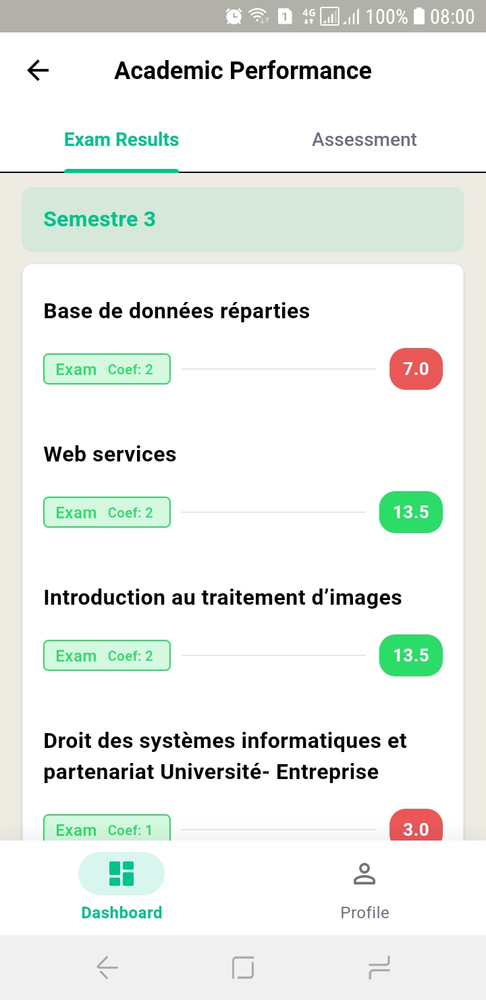
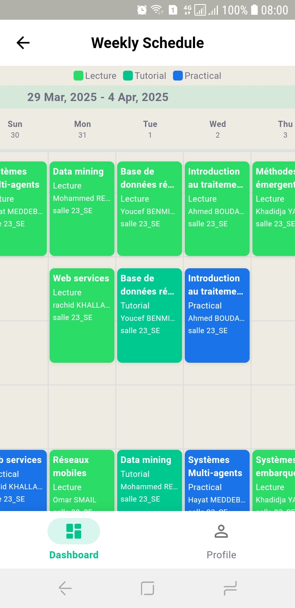

# Progres


## About
Progres is an independently developed remake of Progres/Webetu with a focus on enhanced user experience through Material Design principles. This mobile application allows university students to access their academic information seamlessly, with or without an internet connection.

> **Note:** This application is not officially affiliated with Progres/Webetu or any educational institution.

## Key Features

- **Modern UI/UX** - Intuitive interface built with Material Design 3
- **Bilingual Support** - Full support for both Arabic and French/Latin scripts
- **Enhanced Performance** - Optimized for speed and reliability

## Screenshots

<p align="center">
  
   
  
</p>

<p align="center">
  
  
  
  
</p>

## App Modules

### Authentication
Secure login with institutional credentials and robust session management

### Student Profile
Complete personal information display with bilingual support

### Academic Records
- Current academic year details
- Enrollment information
- Educational level data
- Transportation status

### Performance Tracking
- Exam results by course
- Continuous assessment grades
- Appeal window information

### Weekly Timeline
Interactive view of class schedule

## Technical Details

### Built With
- Flutter for cross-platform compatibility
- BLoC pattern for state management
- Secure local storage for offline capabilities
- RESTful API integration

### Architecture
- Clean architecture with separation of concerns
- Repository pattern for data management
- Service-oriented design for API communication

## Getting Started

### Prerequisites
- Flutter SDK (version 3.0 or higher)
- Dart SDK (version 2.17 or higher)
- Android Studio or VS Code with Flutter extensions

### Installation

1. Clone the repository
   ```bash
   git clone https://github.com/aliakrem/progres.git
   ```

2. Navigate to project directory
   ```bash
   cd progres
   ```
   

3. Install dependencies
   ```bash
   flutter pub get
   ```

4. Run the app
   ```bash
   flutter run
   ```

## Roadmap

- [ ] Push notifications for grade updates
- [ ] iOS version

## Contributing

[View contributing guidelines](https://github.com/AliAkrem/progres/blob/master/CONTRIBUTING.md)

## License

This project is licensed under the MIT License - see the [LICENSE](LICENSE) file for details.


---

<p align="center">
  Made with ❤️ by 
</p>
<p align="center">
  <a href="https://github.com/aliakrem/progres/graphs/contributors">
    
  </a>
</p>
